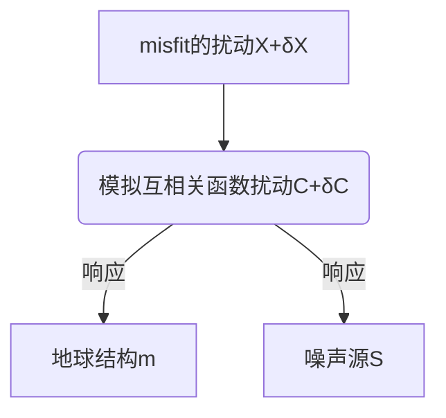

# 4.1 摘要
**（1）基于格林函数重建的干涉测量**

从互相关函数重建格林函数常用的数学模型：

* normal-mode
* 平面波分解
* 表示定理

基于的假设不同，但却是有内在联系的，如：<u>波场均分</u>&噪声源均匀分布

当实际情况不满足假设条件时，会对走时、振幅和波形的测量带来误差，影响该类方法的准确性

**（2）无格林函数重建的干涉测量**
基本原理：对于给定的噪声源功率谱密度分布以及适当的地球模型（可能是衰减的，非均质的和各向异性的），直接对台站间相关性进行建模。

相关应用资料：
1. [noisi: A Python tool for ambient noise cross-correlation modeling and noise source inversion](https://se.copernicus.org/preprints/se-2020-57/)
2. https://github.com/lermert/noisi

**（3）噪声干涉测量的替代方法**

* 反褶积干涉测量
* 多维反褶积干涉测量
* 尾波迭代互相关

# 4.2 引言
**噪声波场Equipartition(均分)**

含义：所有传播模式的强度相当，且统计上不相关。

产生：Equipartitioning(均分)可以直接通过不相关且分布均匀的噪声源的作用而产生，也可以通过足够强的多次散射间接产生。

Zhou Lianqing，Song Xiaodong et al(2020，GJI）的文章中提到，完全扩散波场通常定义为全局均分的波场

**地球上的波场通常不是均分**
原因：
* 散射太弱，衰减太强而不能产生多次散射
* 噪声源分布不均，且随时间变化

不基于经验格林函数重建的方法起源于日震学，厉害了我的哥！

基模面波的频率相关到时在经验上是相当稳健的（因此这是主流的做法），波场的其他分量不满足格林函数重建的要求。由于一些已经得到证实的问题：走时和振幅（测量）的误差、高阶面波的错误（测量）、虚假到时的存在、体波较弱或者根本不存在，限制了有限频和波形反演技术的应用（这类技术是通过完整的波形提高分辨率）
# 4.5 无格林函数的干涉测量
互相关函数作为一个确定的时间序列，互相关函数通过灵敏核建立起与噪声源和地球结构之间的联系。
这会使得反演成为一个噪声源和地球结构的耦合问题。
有一种尝试是从海浪模型获取噪声源信息。

几个较为有代表性的应用：
* Tromp et al. (2010)
* Hanasoge (2013)
* Fichtner et al., (2017a)

## 4.5.1 对互相关函数进行建模
从表示定理出发得到的互相关函数时域的表示：

$C\left(\mathbf{x}_{A}, \mathbf{x}_{B}\right)=\left\langle u\left(\mathbf{x}_{A}\right) u^{*}\left(\mathbf{x}_{B}\right)\right\rangle=\int_{\partial D} G\left(\mathbf{x}, \mathbf{x}_{A}\right) G^{*}\left(\mathbf{x}, \mathbf{x}_{B}\right) S(\mathbf{x}) d \mathbf{x}$

为了对地球结构$m$和噪声源$S$进行估计，需要将模拟的互相关函数$C\left(\mathbf{x}_{A}, \mathbf{x}_{B}\right)$和观测的互相关函数$C^{O}\left(\mathbf{x}_{A}, \mathbf{x}_{B}\right)$进行对比。为了简单，定义了L2范数意义下的波形误差函数（misfit）
$\chi=\frac{1}{2} \int\left[C\left(\mathbf{x}_{A}, \mathbf{x}_{B}, \omega\right)-C^{o}\left(\mathbf{x}_{A}, \mathbf{x}_{B}, \omega\right)\right]^{2} d \omega$
基于Parseval定理，时域可表示为：
$\chi=\frac{1}{2} \int\left[C\left(\mathbf{x}_{A}, \mathbf{x}_{B}, t\right)-C^{o}\left(\mathbf{x}_{A}, \mathbf{x}_{B}, t\right)\right]^{2} d t$

但这个表示对我们的目的（对地球结构$m$和噪声源$S$进行估计）不是很方便。可采取如下思路：

模型与misfit之间的关系可以用Fréchet或敏感核表示
## 4.5.1 噪声源灵敏核

# 4.6讨论

## 4.6.1 格林函数重建
**绝大多数噪声干涉测量是基于台站间的相关性重建格林函数，究其原因：**
1. 相关函数的计算是一种简单的数学操作，结合现代计算机可以处理大量数据
2. 基阶面波的频率相关的走时（频散）在经验上较为可靠，在很多应用中与格林函数的旅行时足够相关
3. 毋需发展新的反演技术，可在地震事件或主动源的反演技术上开展

**存在的缺陷**：
（1）缺乏适用于复杂地球的理论
换句话说，地球的实际情况不满足格林函数重建的理论假设。
地球的复杂性：地球的3D非均匀性、衰减、各向异性，噪声波场的非均分性，噪声源分布的非均匀性和时变性
影响：……
（2）科学哲学困境
整的挺高端~

一般来说，只要没有观察到的现象是物理理论无法解释的，它就是有效的。然而，实际数据的噪声相关性通常带有明显的不是格林函数的迹象（如：虚假到时，相位丢失），实用主义可以忽略这部分，但是并不能否认这其存在。

## 4.6.2 无格林函数的干涉测量
基于可能随时间和空间变化的噪声噪声功率谱密度分布，进行互相关函数的建模。

基于模型空间采样或者有限频灵敏核，观测到的相关函数变化可与地球结构和噪声源的变化联系起来。

优点：（1）概念清晰；（2）提供了在互相关函数中利用波形的机会（格林函数中是不可能的）

有山师兄提到的一篇文章（利用波形信息）：

* [Tromp J, Luo Y, Hanasoge S, et al. Noise cross-correlation sensitivity kernels[J]. Geophysical Journal International, 2010, 183(2): 791-819.](https://academic.oup.com/gji/article/183/2/791/656248#11344119)

缺点:   数学和计算上的复杂性，主要表现在两个方面：

1. 正演问题不能简单地通过计算两个接收台站之间的格林函数来解决，传统的忽略有限频率效应的反演方法可能不再适用
2. 当同时考虑噪声源和结构的反演时，会不可避免的增加模型空间维数和零空间。

    只有当源和结构同时受到约束时，成像才能取得较好的结果。（类似地震时间层析成像）
    
    作为源和结构联合反演的一种替代方法，未来可能会考虑来自物理噪声源模型的信息，这些信息将海浪与噪声源功率谱密度联系起来。

 ## 4.6.3 处理的重要性

为了获得更加可信的格林函数，前人发展了一系列处理和叠加的框架：

| 方法或技术                                           | 来源                                                         | 备注 |
| ---------------------------------------------------- | ------------------------------------------------------------ | ---- |
| 因果与非因果信号叠加、频谱白化、时域平均、频域归一化 | Bensen et al., 2007; Groos et al., 2012                      |      |
| one-bit归一化                                        | Larose et al., 2004; Shapiro and Campillo, 2004; Cupillard et al., 2011;Hanasogeand Branicki, 2013 |      |
| 基于Hilbert变换的相位加权叠加                        | Schimmel and Paulssen, 1997; Schimmel et al., 2011           |      |
| 基于S变换的相位加权叠加                              | Baiget al., 2009                                             |      |
| 定向平衡（directional balancing）                    | Curtis and Halliday, 2010                                    |      |
| Welch重叠时间窗方法                                  | Welch, 1967; Seats et al., 2012                              |      |
| 曲波去噪滤波器的应用                                 | Stehly et al., 2011                                          |      |
| 序列的选择和噪声抑制滤波器                           | Boué et al., 2014; Nakata et al., 2015                       |      |
| 注：                                                 |                                                              |      |
* spectral whitening和frequency-domain normalization似乎不是一回事？？？

* * *
处理过程的差异会使得计算的互相关函数存在显著差异（Bensen et al., 2007）
处理改变了互相关波形，但互相关波形的sensitivity本身不是问题（存疑）。如果在正演建模中没有考虑处理的因素，会使得其成为一个问题。
从地震层析成像的经验，只有当观测和正演建模以同样的方式（同等精度）进行时，才有可能保证将二者间的细微差别映射到源和结构中，（否则就可能是其他因素导致的）

现阶段的噪声干涉测量的处理和正向建模的精度尚不处于同一层级，即在正向建模中并未考虑各种归一化和精细叠加等处理。这会对源和结构的反演带来误差。

**[Fichtner等(2017)](https://academic.oup.com/gji/article/208/2/603/2447807)等已经发展了考虑处理因素的噪声正演理论，但有待于应用于实际数据。**

## 4.6.4 干涉测量的替代方法

在早期认识到格林函数重建的理论前提在地球上不能满足，使得前人发展了一系列环境噪声干涉测量的替代方法。

* 反褶积干涉测量（Snieder and ¸ Safak, 2006; Vasconcelos and Snieder, 2008a,b）
用除法替相关的频域乘法，所得到的干涉图对场源的依赖较小，但仍是格林函数的近似。

* 多维反褶积干涉测量（Wapenaar t al., 2008; Wapenaar and van der Neut, 2010; Wapenaar et al., 2011）
校正缺失的波场均分。噪声互相关的虚拟源不是一个局部的点源，而是一个point-spread function。对这个point-spread function进行反褶积，用以获得更好的格林函数的近似。

* 尾波迭代相关（Stehly et al., 2008）
在地球上，尾波互相关（多次散射间接产生）的波场相较于常规噪声源（噪声源直接产生）更接近于均分波场。依赖于散射体的分布。

 