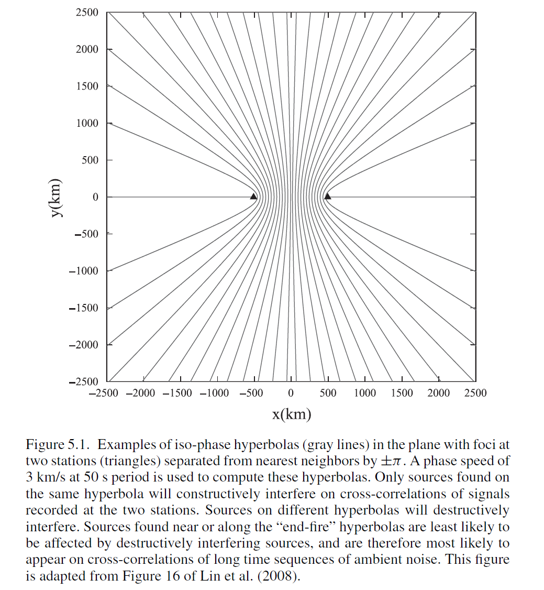
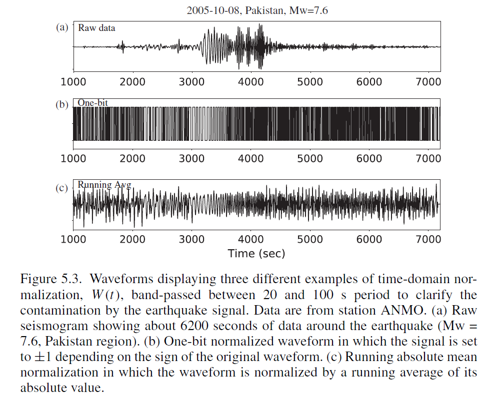

### 5 环境噪声相关的预处理和后处理

#### 摘要

环境噪声所有的应用(无论是研究噪声源或者是研究传播媒介(静态或时变))，基本上都是基于单一观测的挑战。所谓挑战，指的是在处理原始地震记录时既需要增强感兴趣的信号，又需要压制不感兴趣的信号。这里我们总结了在海洋和大陆环境下实现这一微妙任务的方法，并回顾了解决了这一观测挑战的额证据。

#### 5.1 引言

本章的目的是讨论为环境噪声数据处理准备地震记录的问题，并评估这些记录的互相关在多大程度上反映了地球的信息。我们将关注于在相对长距离(几十到几千公里)观测的相对长周期(5-100s)的宽频地震数据。这一类记录在新一代宽频地震台网(如: USArray)的数据，以区域范围(即，几十到几百公里不等)的横向分辨率提供关于地球的信息。从环境噪声得到的这种信号的性质具有丰富的基阶信息，因此(所得到)的与地球相关的信息大多与地壳和上地幔的结构相关。虽然我们关注点比较集中，忽略了在勘探地震学和体波提取中可能遇到的问题，体波提取将在Chapter 8中讨论(Nakata and Nishida, 2018),但是我们所考虑的问题仍是比较普遍的。我们要解决的问题是，如何从大多数人认为是噪声的观测中提取关于地球的可靠信息。

我们(所涉及)的方法是具备可操作性、非启发式，并不是非常严格。它不是历史的，我们不试图提供在环境噪声地震学十几年的历史中发展起来的预处理和后处理流程的全面总结。相反的，我们旨在提供一个讨论，对于研究这一课题的研究人员而言，这可能是一个有用的起点或引导，用以开展他们自己在环境噪声地震学领域的开创性工作。

值得注意的是，地震学家可以从地震噪声记录中获取确定性的结构信息。Snieder(2004)给出了清晰和严谨的证明，由两个台站记录的地震记录的互相关可以推导出台站之间的格林函数，证明了至少在理想的情况下是可行的。格林函数是介质的脉冲响应，并且提供了在台站间传播的介质的结构信息。

读者可以参考Chapter 4(Fichtner and Tsai, 2018),其中更全面地讨论从环境噪声中产生信号的理论(基础)。然而，前一段所提到的理想情况，极为关键的一点是环境噪声源要求是不相干的，在时间和空间上是随机均匀分布的。地球上的观测条件并不能满足这些条件。因此，任何数据处理程序所能达到最佳效果也只能得到格林函数的近似。

图5.1给出了一个启发性解释，为什在实践中可以从环境噪声的互相关得到格林函数的近似。双曲线被定义为在平面上距离两个定点的距离为常数k的点集。图5.1 显示了一组双曲线，其中两个固定的点是一对地震台站(图中的两个三角形)。每一个双曲线都由一个常数k来表示，相邻的双曲线相差$\pi$。因此，图5.1的双曲线是一组常数$k$的等值曲线。这张图表明，当双曲线从水平方向(即两个台站所在的方向)向外发散时，其距离越来越近。因此，在平面上的大部分区域，两个间隔很近的地震事件产生的波会在不同的时间(或者称为相位，即时间除以周期)到达两个台站，除非它们几乎完全沿着其中一条双曲线。而相位差在很大程度上依赖于事件的相对位置。如果这些地震事件具有相似的振幅，其被两个地震台站所记录的地震波形则会有显著的差异，因此，这会对这些地震记录的互相关产生破坏性的干扰(相消干涉)。对于上面所谈到的相消干涉，针对我们研究目标，有一好一坏两种意外的情况。

(1) 第一种情况，当事件几乎与两个台站平齐(即所谓的"尾端发射"方向)，其在两个台站的记录中更有可能以相似的相位到达，因为水平的双曲线彼此之间更分离。这类事件对两个台站的互相关往往会起到增益相干的作用。与其他方向的事件的相消干涉一致，正是这种与台站方向一致的事件影响的增益相干，只要能够有足够数量的事件发生，就能够在两个台站的互相关中恢复波的传播。正如在5.2节讨论的，只要在"尾端发射"的发现有一定的事件，并且观测的时间足够长，在这种情况下台站对之间的互相关就能够与格林函数建立联系。

(2) 然而，第二种情况是有害的，要么发生了一个大的(相较于其他干涉源振幅大得多)地震事件，或者是在一个特定的地点有一系列小的地震事件。在这种情况下，其到时不会对两个台站记录的互相关产生破坏性的干扰，而是会产生一个与台站之间格林函数无关的干涉信号的产生。这种类型的时间诸如几内亚湾的微震(e.g., Shapiro et al., 2006)，也被称为26s微震；(日本的)由阿苏火山引发的九州微震(Zeng and Ni, 2010), 在东亚地区台站的环境噪声互相关中，已经能够清楚地观测到其影响(Zheng et al., 2011)。

这一章(旨在)讨论已经出现的有助于提取清晰的估计格林函数/经验格林函数(clear estimated (or empirical) Green’s functions)的观测技术，同时也要区分噪声的来源，如大地震或者持续的局部微震。所估计的格林函数的应用将在Chapter 7进行讨论。图5.2展示了一个从宽频台站HRV和ANMO长达一年的连续记录所估计的格林函数的实例，并且划分成了不同的频带。这样的记录是寻求环境噪声层析成像的基石。

这两种情况下会产生清晰的虚假到时，而在这两种之间的中间情况会提供清晰的估计/经验格林函数。虚假到时以方位上不均匀的噪声源分布为特征，在某些方向上要强于其他方向。许多研究已经考虑了这种在自然界中很常见的情况是否能够提供可靠的经验格林函数估计，并且发现只要在"尾端发射"方向存在噪声源，最终都会产生一个可靠的经验格林函数(e.g., Lin et al., 2008; Yang and Ritzwoller, 2008)。这只是一个观测时间是否足够的问题。但是，对于观测者而言，怎么才知道需要经过多少时间才能够产生具有意义的经验格林函数的估计？这是在环境噪声地震学中主要的实际问题之一。该问题的另一个表述方式是，噪声中是否产生了足够的有用信号？

这些问题并没有明确的答案，但是有许多相关的指标，将在讨5.6节讨论。我们现在讨论一条特别重要的证据，与所谓的前兆噪声有关(precursory noise)。互相关信号的到时是两个台站所记录到时的差异。位于两个台站直线的垂直平分线上的事件在两个台站的到时是相同的，从而在互相关上会产生零到时。相反，位于“尾端发射”方向的时间则会产生由两个台站之间的传播相位相分隔的到时。因此，“尾端发射“时间对于经验格林函数的重建具有增益相干的效果，在互相关函数上产生最近的到时。其他事件会产生更早到达的信号，并且叠加在噪声互相关中会产生前驱噪声。与感兴趣的信号振幅相比的前驱噪声的水平是一个很好的指标，表明该方法可以收敛到一个可靠的经验(估计)格林函数。一些学者已经通过使用前驱噪声观测用来定位局部的持续噪声源(e.g., Tian and Ritzwoller, 2015)。我们将在5.6节再次讨论前驱噪声这个话题。

本章结构如下。在5.3节中，我们提供了在本章会使用到的符号和术语，并大致讨论环境噪声数据的处理。最后，我们寻找了一系列能够提供地球宽频、低方差和无偏信息的观测方法。此外，我们也找到了一些能够加速收敛、减少观测时间的方法。以此为目标，5.3节和5.4节讨论了大陆背景下Rayliegh波和Love波环境噪声数据处理的一些具有事件价值的具体应用，5.5节则讨论了在海洋环境的数据处理。5.6节讨论了什么可以作为后处理评估：我们应该怎样对波形记录进行取舍(并不是所有的数据都能够准确反映地球的结构)，该如何量化面波频散曲线测量和频散图的不确定性，以及我们怎么知道最终的结果是正确的。5.7节我们将展示一些新方法的实例，展示出他们改进环境噪声数据处理质量的能力。

#### 5.2 理想条件

$\boldsymbol u=(u, v, w)$表示任意地点所记录的地面运动，其中$u$表示垂向分量(Z), $v$和$w$表示两个水平分量(东向E和北向N分量)。让$u_{i}(t)$和$u_{j}(t)$分别表示台站$i$和台站$j$(距离为$r$)在有限时间$t \in[0, T]$内所记录的垂直分量的地震图，这些记录(频域的互相关函数)的交叉频谱可表示为：
$$
\gamma_{i j}(\omega) \equiv u_{i}(\omega) u_{j}^{*}(\omega)\tag{5.1}
$$
其中$u(w)$为$u(t)$的傅里叶变换，$\omega$表示频率，$*$表示复共轭。时域的互相关函数等价于$\gamma_{i j}(\omega)$的反傅里叶变换，用$\gamma_{i j}(\tau)$表示，这里$\tau$为互相关的迟延时间。

通常以某种方式对地面运动的频谱进行归一化时具有实际意义的，
$$
\tilde{u}(\omega) \equiv \frac{u(\omega)}{N(\omega)}\tag{5.2}
$$
其中$N(\omega)$，通常为实值函数，为频谱归一化函数。我们使用'~'​表示频谱归一化。在这种情况下，我们得到了频谱归一化的交叉频谱、
$$
\tilde{\gamma}_{i j}(\omega) \equiv \tilde{u}_{i}(\omega) \tilde{u}_{j}^{*}(\omega)=\frac{u_{i}(\omega) u_{j}^{*}(\omega)}{N_{i}(\omega) N_{j}(\omega)}\tag{5.3}
$$
例如$N(\omega)=|u(\omega)|$, 其中$|·|$表示模量。通过这种方式进行归一化，$\tilde{\gamma}_{i j}(\omega)$具备了复杂的相干性，$\tilde{\gamma}(\tau)$是时域的相干性，$\tilde{\gamma}(\omega)$对应其傅里叶反变换。

Snieder(2004)等人认为在理想的情况下，互相关的时间导数与两个台站之间的格林函数成比例，而这个与频率相关的比例常数取决于地面运动的源频谱。Aki(1957)等人认为当取交叉频谱的平均值时，这些条件可以近似满足：
$$
\Gamma_{i j}(\omega) \equiv<\gamma_{i j}(\omega)>\tag{5.4}
$$
其中$<·>$表示总体的平均值。我们使用上述的大写符号表述的总体平均。在这种情况下，
$$
\frac{d \Gamma_{i j}(\tau)}{d \tau} \propto\left\{\begin{array}{ll}
-G_{i j}(\tau) & \tau \geq 0 \\
G_{j i}(-\tau) & \tau<0
\end{array}\right. \tag{5.5}
$$
其中$G_{ij}$为台站$i$和$j$之间的格林函数，$G_{ji}$为互易格林函数(台站$j$和$i$之间), $\propto$表示成比例。该成比例性也同样适用于频率归一化互相关的总体平均值$\tilde{\Gamma}_{i j}(\tau)$

方程(5.5)给出了环境噪声层析成像的基础，即，至少在理想的情况下，互相关函数可以用来估计一个台站对之间的格林函数。

我们还没有讨论所谓整体平均$<·>$的含义。这里我们遵循Aki(1957)提出的，将整体平均定义为一段时间或一段时间间隔内的平均值。用$u_{i}^{k}(t)$和$u_{j}^{k}(t)$表示台站$i$和$j$在有限的时间(使用索引$k=1,…,K$)内所记录的地面运动的垂向分量。因此，时域的互相关函数的整体平均可表示为：
$$
\Gamma_{i j}(\tau)=<\gamma_{i j}(\tau)>\approx \sum_{l} W_{k}(\tau) \gamma_{i j}^{k}(\tau)\tag{5.6}
$$
其中函数$W_{k}(\tau)$组成了一系列时域权重值(可能与时间相关)。因此，整体平均可以近似为在一组离散的时间间隔内互相关的加权平均值。方程(5.6)所描述的整体平均过程通常被称为“叠加”。叠加的信号有时也被称为"估计格林函数"或者经验格林函数(EGFs), 有时会引起误解，因为他们其实他们的时间导数才与格林函数相关。我们注意到互相关的信号与互相关的时间导数的信号具有相同的群速度，这也是为什么会将互相关称为EGF的原因之一。然而，这个专用术语事实上是较为草率的，因为二者的相速度是不同的。

方程(5.6)中的时间$\tau$指的是互相关的迟延时间，既可为正也可为负。分离互相关的正支和负支通常是十分有用的，如下所示：
$$
\Gamma_{i j}^{+}(\tau)=\Gamma_{i j}(\tau) \quad \text { and } \quad \Gamma_{i j}^{-}(\tau)=\mid \Gamma_{i j}(-\tau), \quad \tau \geq 0 \tag{5.7}
$$
一个相关的概念是互相关所谓的"对称分量"，定义如下：
$$
\Gamma_{i j}^{s y m}(\tau)=\frac{1}{2}\left(\Gamma_{i j}^{+}(\tau)+\Gamma_{i j}^{-}(-\tau)\right), \quad \tau \geq 0\tag{5.8}
$$
这只是反映了延迟时间$\tau=0$时刻互相关的平均值。在这个定义下，方程(5.5)可以重写为如下形式：
$$
\frac{d \Gamma_{i j}^{s y m}(\tau)}{d \tau} \propto-G_{i j}(\tau), \quad \tau \geq 0\tag{5.9}
$$
类似于方程(5.4)-(5.9)也适用于频域归一化的整体平均，$\tilde{\Gamma}_{i j}(\tau)$，及其对称分量$\tilde{\Gamma}_{i j}^{sym}(\tau)$。

#### 5.3 实例：大陆Rayleigh波

在5.2节中我们指出，如果某种"理想条件"得到满足，两个台站所记录的环境噪声的互相关的整体平均值与两个台站之间的格林函数成比例。这一类函数通常被称为"估计格林函数"。理想条件包括1)各向同性的环境地震波场，2)能量在介质的基阶模式呈均分性质。这些条件在地球上基本上所有的应用都不能满足。在本章所考虑的尺度和频带范围内，互相关中主要是面波信号。因此，模式均分并不能满足。而且，长距离传播的环境噪声通常起源于海洋，在某些方位具有更强的激发强度。其他强烈的单一的噪声源(e.g., 地震事件和其他持续的噪声源)进一步破坏了理想条件。

观测地震学家所面临的实际挑战是，在没有理论基础的保证下，能够从环境噪声的互相关中尝试提取有意义的近似/估计格林函数。这一类的尝试是十分成功的。正如引言所提到的，我们的目的在于最小化误差，评估不确定性以及尽可能拓宽观测的频带范围。为了达到这一目的，5.2节所提到的几个变量进行调整，而且环境噪声地震学的许多实际工作都致力于对参数空间进行系统性探索。这些变量包括时域($T$)互相关中的速度或节奏(?)，时域权重($W(t)$)和频域的归一化($N(\omega)$)。许多研究人员的文章都致力于尝试多种参数或者其他参数，用于提取介质的可靠的格林函数。我们将不尝试总结这些研究，而是对这些变量的选择所涉及的问题进行一般性讨论。

再次强调，对于大多数研究人员(尤其是地壳成像), 其真正感兴趣的问题在于将观测频带拓宽到微震(8-20s)之外，在于尽可能将环境噪声的方位各向异性消除以及识别和消除任何的仪器问题。对于优化噪声的方位各向同性，一个主要的关注点在于尽可能最小化地震事件和局部持续的噪声源，二者都可能仅存在与某一个方位。

成功的关键指标之一是前驱信号(即在感兴趣的信号之前到达的信号)相比较感兴趣的信号(通常是指基阶面波)小得多。

##### 5.3.1 互相关的“Cadence Rate”

这里所介绍的大多数示例中， 用于计算互相关的时间序列长度$T$为一天。在选取一天的数据后，我们一般先去除仪器响应，去均值和线性趋势，并进行带通滤波。

一天的数据长度其实是临时的选择， 一些研究者已经提倡选择更短的时间长度(e.g., Prieto et al., 2011)。更快的“Cadence Rate”的互相关(时间长度更短)的优势之一在于能够(更好地)处理地震源(的影响)。例如，如果时间长度为1h，倘若在该时间段的波形记录中包含地震或者存在仪器问题，一小时的记录可以简单的予以舍弃。(然而)，人们可能不愿意用牺牲一天的数据来消除这种影响，采用较低的“Cadence”互相关的速率，会倾向于引入某种与时间相关的权重，<u>用以连续降低对已经确定了这种影响的时间范围的影响</u>，正如在后面的内容所提到的。然而，引入这类权重的缺点便是会失去有意义的振幅信息。因此，希望得到可靠的振幅信息的研究人员可能会更感兴趣于1）增加互相关的“Cadence Rate”，2）采用二进制时域加权方案：对于地震事件或者是仪器问题的时间用0表示，其他时间用1表示。

##### 5.3.2 时域加权

从事环境噪声地震学的工作人员往往会采取比3.1节所提到的二元选择更为详细的时域加权方案。这些替代方案中的一些旨在通过降低特定方位的信号方式使环境噪声信号在方位上均匀化，这些信号要么特别强(如：地震)，要么就是持续的信号(如：26s微震，九州微震)。图5.3展示了3中时域加权的替代方案，$W(t)$: 没有加权，one-bit归一化，绝对平均加权。

